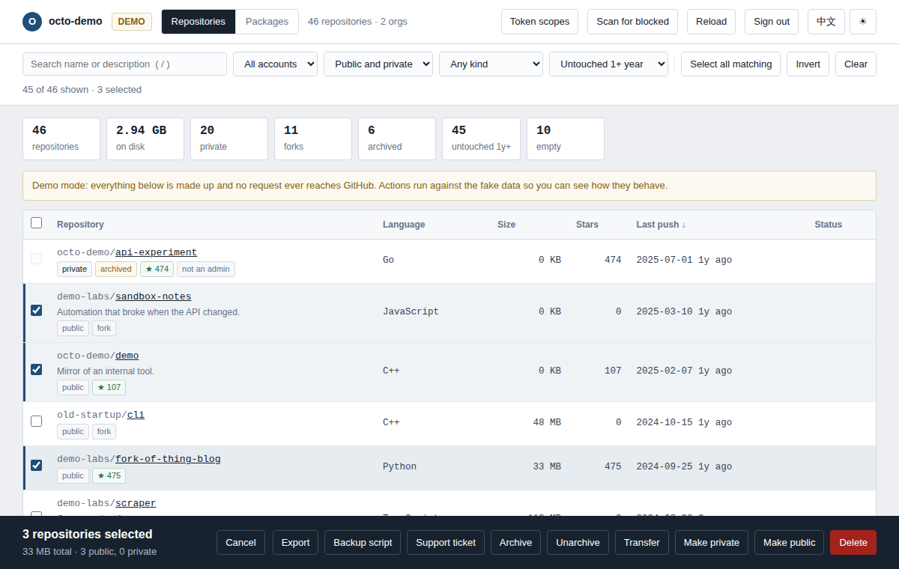
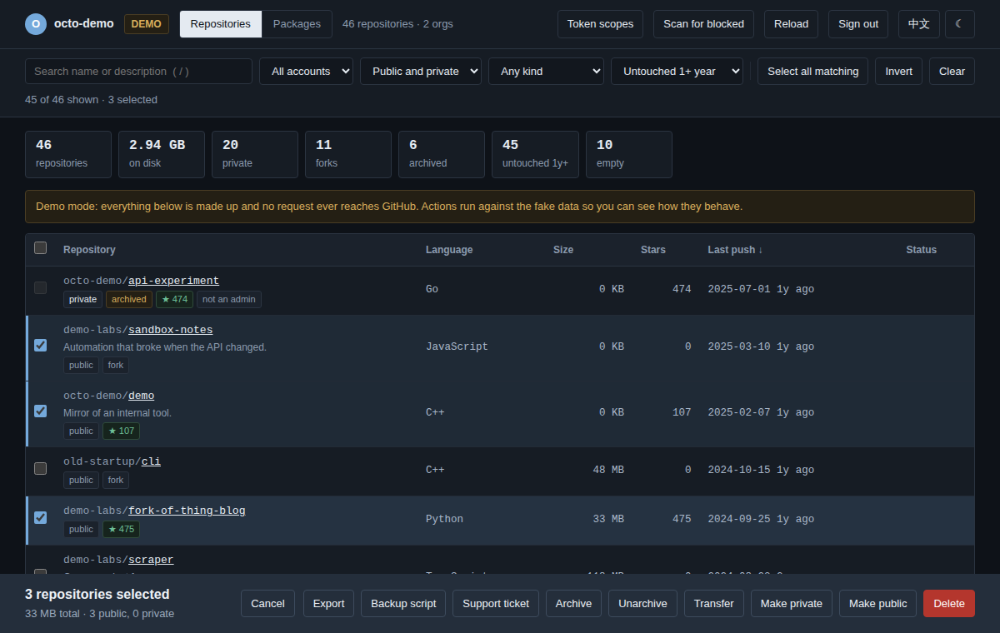

# GitHub Repo Cleaner

Bulk-manage the repositories and packages on your GitHub account from one page: filter
hundreds of repos down to the ones you have forgotten about, then archive, transfer,
flip visibility, prune old package versions, or delete them — in one pass, with a
confirmation list in front of every action.

**[Open the app](https://always1ov.github.io/github-repo-cleaner/)** ·
[中文说明](README.zh-CN.md)



<details>
<summary>Dark theme</summary>



</details>

There is a **demo mode** on the landing page. It runs on made-up data and sends no
request anywhere, so you can click every button — including Delete — before deciding
whether to trust the tool with a token.

## Why it is safe to paste a token here

This tool asks for a token that can delete every repository you own. That deserves more
than a promise, so the guarantees are structural and you can check each one in a minute:

| Guarantee | How to verify it yourself |
|---|---|
| The page can reach **exactly one host**, `api.github.com`. A `Content-Security-Policy` in the document tells your browser to block everything else — other hosts, images, fonts, frames, analytics. A leak is not a matter of trust; the browser refuses it. | View source, first 10 lines. Or open DevTools → Network and watch. |
| **No server, no build step, no dependencies.** One HTML file, no `<script src>`, no CDN, no npm packages at runtime. | `grep -o '<script[^>]*>' index.html` → one `<script>`, no `src` |
| **The token is never stored.** It lives in one JavaScript variable for the life of the tab. No `localStorage`, no cookie, no URL parameter. Reload and it is gone. | `grep -n 'localStorage\.' index.html` → two hits, `prefGet` and `prefSet`, which only handle language, theme and page size. |
| **It works offline.** Download the file and open it from your disk; it never needs this repo again. | Save the page, turn off Wi-Fi, open it — the UI loads fine (only API calls fail). |
| **No dynamic code.** No `eval`, no `new Function`. | `grep -nE "eval\(|new Function" index.html` → nothing. |

All five are enforced by tests that run in CI, so a future commit cannot quietly break
them. See [SECURITY.md](SECURITY.md) for the threat model.

## Getting started

1. Create a token at [github.com/settings/tokens](https://github.com/settings/tokens).
   A **classic** token works best — see the scopes below.
2. Open the app — [hosted](https://always1ov.github.io/github-repo-cleaner/), or
   download [`index.html`](index.html) and double-click it.
   *(Hosting this yourself? Set Settings → Pages → Source to **GitHub Actions**
   once; the deploy workflow handles every push after that.)*
3. Paste the token and press **Read my account**.
4. Revoke the token when you are done.

### Token scopes

| Scope | What you lose without it |
|---|---|
| `repo` | Everything — private repositories are invisible and nothing can be changed |
| `delete_repo` | Delete fails with 403 (the app warns you up front instead of at failure time) |
| `read:org` | Organization repositories and the transfer target list |
| `read:packages` | The Packages tab stays empty |
| `delete:packages` | Deleting packages and pruning versions |

Fine-grained tokens can manage repositories — set *Repository permissions →
Administration* to *Read and write* — but GitHub's Packages API still accepts classic
tokens only, so the Packages tab will not work with one. **Token scopes** in the header
shows exactly what your token can and cannot do before you try anything.

## What it does

**Find things.** Search names and descriptions; filter by owner, visibility, kind
(source / fork / archived / template / empty / unstarred / undeletable) and staleness
(untouched for 1, 2 or 3 years). The stats strip counts repositories, disk usage, forks,
archives, stale and empty repos — click any of them to filter by it.

**Act in bulk.** Select with click, shift-click for ranges, or *Select all matching*.
Then:

- **Archive / Unarchive** — reversible, and the right first step when you are not sure
- **Transfer** to an organization or another account
- **Make private / Make public**
- **Delete** repositories
- **Prune package versions** — keep the newest N, delete the rest
- **Delete packages**

**Get out cleanly.** Before deleting, generate a `git clone --mirror` **backup script**
for the selection, or **export** it as CSV/JSON. After a run, download a CSV report of
what succeeded and what failed.

**Handle the ones GitHub will not let you delete.** *Scan for blocked* finds
repositories that return HTTP 451 (disabled by GitHub) — neither the API nor the
settings page can remove those. *Support ticket* writes the message to send to GitHub
Support, with each repository and the reason it is stuck.

## Safety rails

- Every action shows the **exact list** it will touch, with stars, forks and archived
  status flagged, before it runs.
- Deletions need **two confirmations**: an acknowledgement and typing `DELETE`.
- Making a repository public requires confirming there are no secrets in its history.
- Items that cannot work are **skipped and explained**, not silently failed — an
  archived repository is read-only, so visibility changes are excluded up front.
- Missing `delete_repo` is caught **before** the run, not on the first 403.
- Long runs can be **stopped mid-flight**; finished items keep their result.
- Rate limits are handled properly: `Retry-After` and `x-ratelimit-reset` are honoured,
  secondary rate limits back off exponentially, and 5xx and network blips retry. If the
  reset is too far away the run stops and says when it recovers, rather than hanging.

## Development

No dependencies, no build. Edit `index.html`, reload the browser.

```sh
npm test            # 43 unit + structure tests, zero dependencies
npm run test:browser  # 12 end-to-end tests in real Chromium (installs Playwright)
```

The unit tests load the real `index.html`: the pure-logic region between the
`/* <core> */` markers is evaluated verbatim, so they test shipped code rather than a
copy. The structure tests assert the security guarantees above, that both languages
define the same keys, and that no translation is dead weight.

## License

[MIT](LICENSE)
